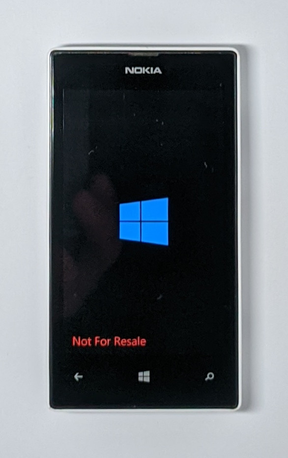

# wpi

The goal was to create a command line version of [WPInternals](https://github.com/ReneLergner/WPinternals) in order to understand how to unlock the bootloader and "root" the Windows Phone OS of Nokia Lumia phones.  

> [!CAUTION]
> Only Lumia 520 is supported.  
> Only OS version 8.10.14234.375 is supported.  
> Only donor OS version 10.0.10586.318 is supported.  

Without the optional parameter `--repair`, this program executes the following steps:  

- Prepare the patched binaries to copy into the phone.  
- Check the compatibility of the phone.
- Flash th original FFU (lock a previously unlocked phone).
- Flash the patched bootloaders
- Patch some files to unlock UEFI and root the main OS.

## General usage

To unlock the bootloader and root the OS you have to give 5 files in arguments:  
- A FFU file corresponding to the partitions currently installed in the phone (it will be our first source to get the binaries of the partitions).
- An image file of an engineering SBL3 (the "engineering" version contains the codes required to boot in "Mass Storage" mode).
- A .hex file containing a programmer (we will use it to flash unsigned images of some partitions).
- A _donor_ FFU file from which we a going to copy the mobilestartup.efi file.
- A special version of the partition UEFI_BS_NV.

> [!NOTE]
> The special version of the partition UEFI_BS_NV is available at the root of this GitHub repository (this is the uncompressed version of the one supplied with [WPInternals](https://github.com/ReneLergner/WPinternals) for family A phones).   

> [!WARNING]
> The program must be run as an Administrator (in order to get SeRestorePrivilege for example).


The optional parameter `--verbose` activates the display of some insights (for example the list of partitions of the GPT) but also all the data exchanged between the host computer and the phone (including the content of the flashed partitions). If you activate this option I advise to redirect the output into a file (**more than 35GB are logged when you unlock a phone !**).

Extract of _verbose_ log:
```
Read Flash application version (require 1.28 <= version < 2.0)...
< 4 bytes
4E 4F 4B 56                                               NOKV
> 91 bytes
4E 4F 4B 56 00 02 01 0F 01 1C 08 01 00 04 00 24 10 00 02  NOKV...........$...
00 04 00 24 00 00 03 00 04 00 E7 40 00 04 00 04 00 3B 50  ...$.......@.....;P
00 05 00 18 4E 6F 6B 69 61 2E 4D 53 4D 38 32 32 37 2E 50  ....Nokia.MSM8227.P
36 30 33 36 2E 31 2E 32 00 0D 00 02 00 01 0F 00 09 03 01  6036.1.2...........
01 01 00 00 01 01 FF 10 00 05 01 00 13 00 00              ...............
FlashApp:
	protocol: 1.15
	version: 1.28
Sub-blocks:
	ID 01
	ID 02
	ID 03
	ID 04
	ID 05
	ID 0D
	ID 0F
	ID 10

Read eMMC manufacturer (Samsung = risk of locking eMMC in read-only mode)...
< 11 bytes
4E 4F 4B 58 46 52 00 43 49 44 00                          NOKXFR.CID.
> 25 bytes
4E 4F 4B 58 46 52 00 00 00 43 49 44 00 00 00 00 08 00 90  NOKXFR...CID.......
00 4A 00 E3 92 E5                                         .J....
eMMC manufacturer: Hynix

Read Root Key Hash of the phone...
< 11 bytes
4E 4F 4B 58 46 52 00 52 52 4B 48                          NOKXFR.RRKH
> 49 bytes
4E 4F 4B 58 46 52 00 00 00 52 52 4B 48 00 00 00 20 F7 71  NOKXFR...RRKH... .q
E6 2A F8 99 94 06 4F 77 CD 3B C1 68 29 50 3B DF 9A 3D 50  .*....Ow.;.h)P;..=P
6D 3F AC EC AE F3 F8 08 C8 68 FD                          m?.......h.
Phone Root Hash Key (256 bits): F771E62AF89994064F77CD3BC16829503BDF9A3D506D3FACECAEF3F808C868FD
```

## Troubleshooting

If you get this error message, close any other program which can try to communicate with the phone (like the real WPInternals for example):
```
Unhandled Exception: System.Exception: Failed to open device. ---> System.Exception: Failed to open WinUSB device handle.
```

The optional parameter `--repair` can be used when the phone is blocked in Emergency Download (EDL) mode. 

## Drivers required

We use USB to establish a communication between the host computer and the phone. Three [WinUSB](https://en.wikipedia.org/wiki/WinUSB) drivers have to be installed in the host computer. Each of these drivers is used at a different point of the unlock process. Usually these drivers are installed with the Windows Device Recovery Tool (WDRT) excepted the Qualcomm driver for the diagnostic interface (PID 9006).
- `WinUsbCompatIdInstaller.msi` to communicate with the Windows Phone OS. The phone exposes the USB device VID_0421&PID_0661
- `WinUsbDriversExt.msi` to communicate with the UEFI applications. The phone exposes the USB device VID_0421&PID_066E
- `EmergencyDownloadDriver.msi` to communicate with the Primary Boot Loader and the Programmer. The phone exposes the USB device VID_05C6&PID_9008
- `QDLoader HS-USB Driver_64bit_Setup.exe` to communicate with the Secondary Bootloader in Mass Storage mode. The phone exposes the USB device VID_05C6&PID_9006

## Unlock procedure

Everything is done in order to make impossible what we want to do: unlock the phone to execute untrusted codes.
But nevertheless we can unlock the phone thanks to the following points:

- The usage of an official programmer.
- This official programmer does not verify what is flashed into the phone.

But most of all, this is possible thanks to the creator of [WPInternals](https://github.com/ReneLergner/WPinternals) who, I guess, spent a lot of time and energy in this project. I'm very grateful to him!

The big picture of the unlock procedure is the following:

1. Go into Emergency DownLoad mode by erasing the GUID Partition Table (there's maybe other means to into Emergency Download mode by doing some electronic modifications, but the solution used by WPInternals does not require any electronic skills).
2. Start the official programmer and use it to flash a modified version of the SBL2, SBL3 and UEFI partitions (these modified versions don't check the integrity of the programs they execute, unlike their official versions).
3. Allow the execution of the modified SBL2 partition by adding an additional partition named "HACK" into the last sector of the partition SBL1. Currently, I don't know how this HACK partition bypasses the integrity check done by SBL1.

> [!NOTE]
> This programm is based on the version 2.9 of [WPInternals](https://github.com/ReneLergner/WPinternals).  
> Starting from this version it's possible to activate _testsigning_ in BCD (to load non officially signed kernel drivers for example).  
> This is possible because the phone is put in a kind of developper mode (a string "Not For Resale" is visible at the bottom of the Windows Phone boot screen).




## Compilation

This program can be compiled with Visual Studio 2015.  

> [!NOTE]
> The build is for x64 in order to be able to execute internally the BCDEDIT command.  

